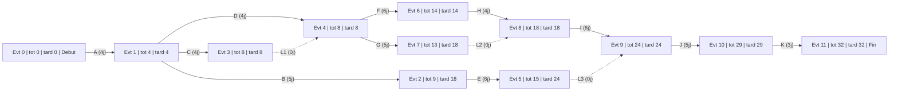
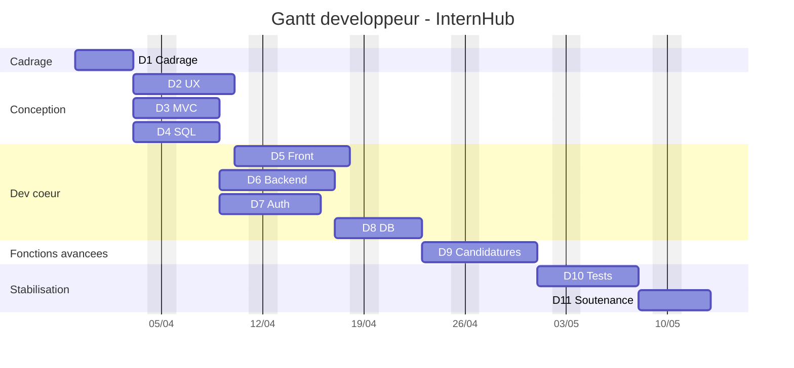

# Diagrammes PERT et Gantt

Ce document propose une vision de planification centree sur les travaux des developpeurs.

Hypothese retenue :
Le terme `diagramme de perte` est interprete ici comme `diagramme PERT`, car c'est le format adapte pour montrer les dependances entre taches projet.

Date de depart proposee :
Le calendrier ci-dessous commence le `lundi 30 mars 2026`.

## 1. Objectif

Ces diagrammes servent a :

- visualiser l'ordre logique des travaux,
- identifier les dependances bloquantes,
- estimer un chemin critique,
- repartir les travaux entre developpeurs sans perdre la coherence technique.

## 2. Perimetre developpeur retenu

Les travaux pris en compte sont les lots techniques principaux :

- cadrage technique et conventions,
- maquettage et parcours publics,
- architecture MVC et routage,
- modelisation des donnees,
- developpement frontend statique,
- developpement backend metier,
- authentification et permissions,
- connexion base de donnees,
- candidatures et wish-list,
- tests, recette et preparation de demo.

## 3. Lots de travail

| Code | Lot developpeur | Duree | Description | Depend de |
| --- | --- | --- | --- | --- |
| A | Cadrage technique | 4 j | conventions Git, organisation, backlog technique, documentation de depart | aucun |
| B | UX et maquettes | 5 j | wireframes, parcours, ecrans principaux | A |
| C | Architecture MVC | 4 j | structure cible, routage, conventions controleurs/vues/models | A |
| D | MCD et schema SQL | 4 j | modelisation, schema relationnel, dictionnaire de donnees | A |
| E | Frontend public | 6 j | integration accueil, listes, details, responsive | B |
| F | Backend entreprises et offres | 6 j | routes metier, controleurs, logique coeur | C, D |
| G | Auth et permissions | 5 j | connexion, sessions, roles, restrictions d'acces | C, D |
| H | Integration base | 4 j | scripts SQL, cles etrangeres, branchement applicatif | D, F |
| I | Candidatures et wish-list | 6 j | postulation, suivi etudiant, vue pilote, wishlist | F, G, H |
| J | Tests et recette | 5 j | tests unitaires, verifications fonctionnelles, corrections | E, H, I |
| K | Preparation soutenance | 3 j | demo, argumentaire technique, justification des choix | J |

## 4. Diagramme PERT chiffre

Convention de lecture :

- nombre en haut a gauche : date au plus tot de l'evenement,
- nombre en haut a droite : date au plus tard de l'evenement,
- nombre en bas : numero de l'evenement,
- nombre entre parentheses sur la fleche : duree de la tache en jours ouvres.

## 5. Correspondance des evenements

| Evenement | Signification | Plus tot | Plus tard |
| --- | --- | --- | --- |
| 0 | Debut projet | 0 | 0 |
| 1 | Cadrage technique valide | 4 | 4 |
| 2 | UX et maquettes terminees | 9 | 18 |
| 3 | Architecture MVC terminee | 8 | 8 |
| 4 | Conception technique stabilisee | 8 | 8 |
| 5 | Frontend public termine | 15 | 24 |
| 6 | Backend coeur termine | 14 | 14 |
| 7 | Authentification et permissions terminees | 13 | 18 |
| 8 | Base integree et dependances techniques levees | 18 | 18 |
| 9 | Candidatures et wish-list terminees | 24 | 24 |
| 10 | Tests et recette termines | 29 | 29 |
| 11 | Fin de la preparation technique | 32 | 32 |

## 6. Lecture du PERT

Points importants :

- `A`, `C`, `D`, `F`, `H`, `I`, `J` et `K` sont critiques pour tenir la duree globale.
- les taches `B`, `E` et `G` disposent d'une marge, ce qui explique l'ecart entre les dates au plus tot et au plus tard de certains evenements.
- les liaisons `C'`, `G'` et `E'` sont des taches fictives de duree `0`. Elles servent uniquement a modeliser correctement les dependances.

Chemins critiques :

- `A -> C -> F -> H -> I -> J -> K`
- `A -> D -> F -> H -> I -> J -> K`

Duree totale estimee :

`32 jours ouvres`

## 7. Diagramme de Gantt

Le diagramme suivant presente une proposition de calendrier equipe simplifiee pour un rendu Mermaid plus propre. Les libelles sont volontairement tres courts et les details sont reportes dans le tableau de correspondance.

Correspondance des codes du Gantt :

| Code | Signification |
| --- | --- |
| D1 | Cadrage technique |
| D2 | UX et maquettes |
| D3 | Architecture MVC |
| D4 | MCD et schema SQL |
| D5 | Frontend public |
| D6 | Backend entreprises et offres |
| D7 | Authentification et permissions |
| D8 | Integration base de donnees |
| D9 | Candidatures et wish-list |
| D10 | Tests et recette |
| D11 | Preparation soutenance |

Principes retenus :

- les weekends sont exclus pour lire le planning en jours ouvres,
- `D5`, `D6` et `D7` avancent en parallele pour representer le travail reel d'une equipe,
- `D8` commence apres la stabilisation du backend coeur,
- `D9` commence une fois la base et les droits suffisamment fiables,
- le chemin critique reste explique dans la partie PERT, pas dans le rendu couleur du Gantt.

## 8. Repartition developpeur recommandee

Cette repartition est une proposition de travail en parallele pour un groupe de 4.

| Membre | Perimetre principal | Travaux prioritaires |
| --- | --- | --- |
| Abdou | Structure applicative | D3, D6 |
| Mehdi | Frontend et integration | D2, D5 |
| Karim | Donnees et SQL | D4, D8 |
| Oussama | Securite et comptes | D7, D9 |

Travail collectif :

- D1 doit etre valide par toute l'equipe.
- D10 et D11 doivent etre prepares collectivement.

## 9. Points de vigilance

- Si `D4` prend du retard, le backend et la base seront bloques.
- Si `D7` est sous-estime, les restrictions de roles seront traitees trop tard.
- Si `D5` avance sans alignement avec `D3`, il y aura des reworks d'integration.
- Si `D10` commence trop tard, la soutenance reposera sur une version instable.

## 10. Usage recommande

Ce document peut servir :

- en reunion d'equipe pour valider l'ordre des travaux,
- en daily pour situer les dependances,
- en soutenance pour justifier la logique d'organisation,
- en backlog refinement pour convertir les lots en user stories et taches techniques.
