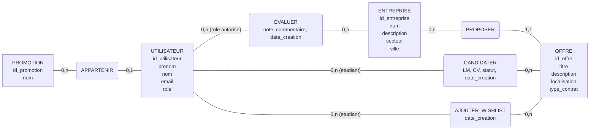
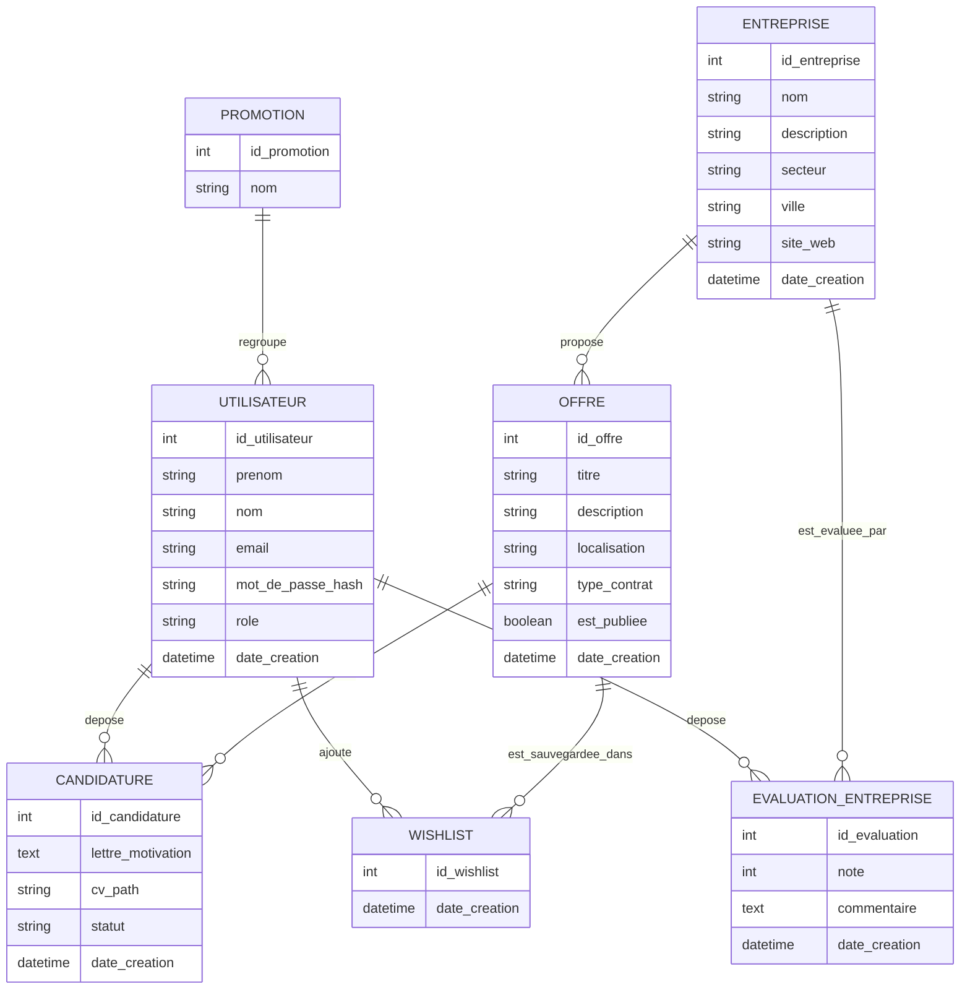
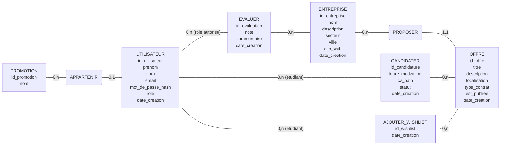

# Modele conceptuel de donnees (MCD)

Ce document propose le `MCD` du projet `InternHub` a partir :

- du cahier des charges,
- des roles et permissions,
- des fonctionnalites coeur du projet,
- et du modele de donnees effectivement implemente.

L'objectif est de decrire le modele `metier`, independamment du SGBD cible (`SQLite`, `MySQL`, `PostgreSQL`, etc.).

## Legende des cardinalites

- `0,1` : participation facultative et unique
- `1,1` : participation obligatoire et unique
- `0,n` : participation facultative et multiple
- `1,n` : participation obligatoire et multiple

## Resume du modele

Le coeur du modele est le suivant :

- une `PROMOTION` regroupe des `UTILISATEURS`,
- une `ENTREPRISE` propose des `OFFRES`,
- un `ETUDIANT` depose des `CANDIDATURES` sur des `OFFRES`,
- un `ETUDIANT` peut aussi ajouter des `OFFRES` en `WISHLIST`,
- une `ENTREPRISE` peut etre `EVALUEE` si cette fonctionnalite est retenue.

## Associations principales
| Association | Entite A | Cardinalite A | Entite B | Cardinalite B |
| --- | --- | --- | --- | --- |
| `APPARTENIR` | `PROMOTION` | `0,n` | `UTILISATEUR` | `0,1` |
| `PROPOSER` | `ENTREPRISE` | `0,n` | `OFFRE` | `1,1` |
| `CANDIDATER` | `UTILISATEUR [etudiant]` | `0,n` | `OFFRE` | `0,n` |
| `AJOUTER_WISHLIST` | `UTILISATEUR [etudiant]` | `0,n` | `OFFRE` | `0,n` |
| `EVALUER` | `UTILISATEUR [role autorise]` | `0,n` | `ENTREPRISE` | `0,n` |

## Schema Merise simplifie

## 1. Perimetre du modele

Le systeme gere :

- les utilisateurs internes de la plateforme,
- les promotions,
- les entreprises,
- les offres de stage,
- les candidatures,
- la wish-list etudiante,
- et, au niveau conceptuel, l'evaluation d'une entreprise, car elle apparait dans le cahier des charges (`SFx5`) meme si elle n'est pas encore materialisee dans le schema physique actuel.

Les roles applicatifs sont :

- `Administrateur`
- `Pilote`
- `Etudiant`
- `Anonyme`

Important :

- `Anonyme` n'est pas une entite stockee en base.
- `Administrateur`, `Pilote` et `Etudiant` sont modeles dans une meme entite `UTILISATEUR`, differencies par un attribut `role`.

## 2. Entites du MCD

## PROMOTION

Represente une promotion academique suivie par un pilote et regroupant des etudiants.

Attributs :

- `id_promotion`
- `nom`

## UTILISATEUR

Represente un compte interne de la plateforme.

Attributs :

- `id_utilisateur`
- `prenom`
- `nom`
- `email`
- `mot_de_passe_hash`
- `role`
- `date_creation`

Remarque :

- selon le `role`, un utilisateur peut etre `administrateur`, `pilote` ou `etudiant`.

## ENTREPRISE

Represente une entreprise referencee dans la plateforme.

Attributs :

- `id_entreprise`
- `nom`
- `description`
- `secteur`
- `ville`
- `site_web`
- `date_creation`

## OFFRE

Represente une offre de stage publiee par une entreprise.

Attributs :

- `id_offre`
- `titre`
- `description`
- `localisation`
- `type_contrat`
- `est_publiee`
- `date_creation`

## CANDIDATURE

Represente l'action d'un etudiant postulant a une offre.

Attributs :

- `id_candidature`
- `lettre_motivation`
- `cv_path`
- `statut`
- `date_creation`

## WISHLIST

Represente l'ajout d'une offre dans la liste d'interets d'un etudiant.

Attributs :

- `id_wishlist`
- `date_creation`

## EVALUATION_ENTREPRISE

Represente une evaluation deposee sur une entreprise.

Attributs :

- `id_evaluation`
- `note`
- `commentaire` (optionnel, si retenu)
- `date_creation`

Remarque :

- cette entite est presente dans le `MCD` car la fonctionnalite `SFx5` existe dans le cahier des charges.
- elle n'est pas encore implemente e dans le schema physique actuel du projet.

## 3. Associations et cardinalites

## 3.1 PROMOTION - UTILISATEUR

Une promotion regroupe des utilisateurs rattaches a une promotion.

Lecture metier :

- une `PROMOTION` peut avoir `0,N` utilisateurs rattaches,
- un `UTILISATEUR` peut etre rattache a `0,1` promotion.

Remarques :

- un `administrateur` n'a pas obligatoirement de promotion,
- un `pilote` est rattache a une promotion dans le projet actuel,
- un `etudiant` est rattache a une promotion.

## 3.2 ENTREPRISE - OFFRE

Une entreprise propose des offres.

Lecture metier :

- une `ENTREPRISE` propose `0,N` offres,
- une `OFFRE` appartient a `1,1` entreprise.

## 3.3 ETUDIANT - CANDIDATURE - OFFRE

Une candidature relie un etudiant et une offre.

Lecture metier :

- un `UTILISATEUR` de role `etudiant` depose `0,N` candidatures,
- une `CANDIDATURE` est deposee par `1,1` etudiant,
- une `OFFRE` recoit `0,N` candidatures,
- une `CANDIDATURE` concerne `1,1` offre.

Regle de gestion importante :

- un etudiant ne peut candidater qu'une seule fois a une meme offre.

Conceptuellement :

- unicite du couple `(etudiant, offre)` dans `CANDIDATURE`.

## 3.4 ETUDIANT - WISHLIST - OFFRE

Une entree de wish-list relie un etudiant et une offre en tant qu'offre sauvegardee.

Lecture metier :

- un `UTILISATEUR` de role `etudiant` peut sauvegarder `0,N` offres,
- une `WISHLIST` appartient a `1,1` etudiant,
- une `OFFRE` peut apparaitre dans `0,N` wish-lists,
- une `WISHLIST` concerne `1,1` offre.

Regle de gestion importante :

- une meme offre ne doit pas apparaitre deux fois dans la wish-list d'un meme etudiant.

Conceptuellement :

- unicite du couple `(etudiant, offre)` dans `WISHLIST`.

## 3.5 UTILISATEUR - EVALUATION_ENTREPRISE - ENTREPRISE

Une evaluation est deposee par un utilisateur autorise sur une entreprise.

Lecture metier :

- un `UTILISATEUR` autorise peut deposer `0,N` evaluations,
- une `EVALUATION_ENTREPRISE` est deposee par `1,1` utilisateur,
- une `ENTREPRISE` recoit `0,N` evaluations,
- une `EVALUATION_ENTREPRISE` concerne `1,1` entreprise.

Regle de gestion metier :

- seuls les roles autorises par la matrice de permissions peuvent evaluer une entreprise.

## 4. Regles de gestion a retenir

Voici les regles metier importantes qui structurent le MCD :

1. un utilisateur possede un seul role applicatif.
2. un administrateur peut exister sans promotion.
3. un etudiant appartient a une promotion.
4. un pilote est rattache a une promotion dans le cadre du projet.
5. une offre appartient obligatoirement a une entreprise.
6. une candidature appartient obligatoirement a un etudiant et a une offre.
7. un etudiant ne peut pas candidater deux fois a la meme offre.
8. une entree de wish-list appartient obligatoirement a un etudiant et a une offre.
9. un etudiant ne peut pas sauvegarder deux fois la meme offre dans sa wish-list.
10. une entreprise peut exister sans offre.
11. une offre peut exister sans candidature.
12. une entreprise peut recevoir des evaluations si la fonctionnalite `SFx5` est retenue dans le perimetre final.

## 5. MCD synthetique

## 5bis. MCD au format Merise avec associations et cardinalites

Cette version reprend une logique plus proche d'un `MCD` classique de soutenance :

- entites,
- associations nommees,
- cardinalites `0,1`, `1,1`, `0,n`, `1,n`.

Elle est plus proche du format attendu en cours qu'un simple schema de tables.

### Lecture generale

- une `PROMOTION` regroupe des `UTILISATEURS`,
- une `ENTREPRISE` publie des `OFFRES`,
- un `ETUDIANT` candidate a des `OFFRES`,
- un `ETUDIANT` ajoute des `OFFRES` en wish-list,
- un utilisateur autorise peut evaluer une `ENTREPRISE`.

### Representation textuelle des associations

#### APPARTENIR

- `PROMOTION` `(0,n)` --- `APPARTENIR` --- `(0,1)` `UTILISATEUR`

Interpretation :

- une promotion peut regrouper zero a plusieurs utilisateurs,
- un utilisateur peut appartenir a zero ou une promotion.

#### PROPOSER

- `ENTREPRISE` `(0,n)` --- `PROPOSER` --- `(1,1)` `OFFRE`

Interpretation :

- une entreprise peut proposer zero a plusieurs offres,
- une offre appartient obligatoirement a une seule entreprise.

#### CANDIDATER

- `UTILISATEUR` role `etudiant` `(0,n)` --- `CANDIDATER` --- `(0,n)` `OFFRE`

Proprietes de l'association :

- `id_candidature`
- `lettre_motivation`
- `cv_path`
- `statut`
- `date_creation`

Interpretation :

- un etudiant peut candidater a zero ou plusieurs offres,
- une offre peut recevoir zero ou plusieurs candidatures,
- conceptuellement, une occurrence de `CANDIDATER` relie un etudiant et une offre.

Regle de gestion :

- un etudiant ne peut candidater qu'une seule fois a une meme offre.

#### AJOUTER_WISHLIST

- `UTILISATEUR` role `etudiant` `(0,n)` --- `AJOUTER_WISHLIST` --- `(0,n)` `OFFRE`

Proprietes de l'association :

- `id_wishlist`
- `date_creation`

Interpretation :

- un etudiant peut sauvegarder zero a plusieurs offres,
- une offre peut apparaitre dans zero a plusieurs wish-lists.

Regle de gestion :

- une meme offre ne peut apparaitre qu'une seule fois dans la wish-list d'un meme etudiant.

#### EVALUER

- `UTILISATEUR` autorise `(0,n)` --- `EVALUER` --- `(0,n)` `ENTREPRISE`

Proprietes de l'association :

- `id_evaluation`
- `note`
- `commentaire`
- `date_creation`

Interpretation :

- un utilisateur autorise peut evaluer zero a plusieurs entreprises,
- une entreprise peut recevoir zero a plusieurs evaluations.

Remarque :

- cette association existe au niveau `MCD` car elle est demandee par `SFx5`,
- mais elle n'est pas encore implemente e dans le schema physique actuel.

### Schema Merise simplifie

### Version tres courte a reproduire sur feuille ou soutenance

Si tu veux le redessiner a la main comme dans ton exemple, tu peux le faire comme ca :

- `PROMOTION` --- `APPARTENIR` --- `UTILISATEUR`
  - cardinalites : `PROMOTION (0,n)` / `UTILISATEUR (0,1)`
- `ENTREPRISE` --- `PROPOSER` --- `OFFRE`
  - cardinalites : `ENTREPRISE (0,n)` / `OFFRE (1,1)`
- `UTILISATEUR [etudiant]` --- `CANDIDATER` --- `OFFRE`
  - cardinalites : `UTILISATEUR (0,n)` / `OFFRE (0,n)`
  - attributs de l'association : `LM`, `CV`, `statut`, `date_creation`
- `UTILISATEUR [etudiant]` --- `AJOUTER_WISHLIST` --- `OFFRE`
  - cardinalites : `UTILISATEUR (0,n)` / `OFFRE (0,n)`
  - attribut : `date_creation`
- `UTILISATEUR [role autorise]` --- `EVALUER` --- `ENTREPRISE`
  - cardinalites : `UTILISATEUR (0,n)` / `ENTREPRISE (0,n)`
  - attributs : `note`, `commentaire`, `date_creation`

## 6. Ecart entre MCD et implementation actuelle

Le `MCD` ci-dessus represente le modele metier du projet.

L'implementation actuelle couvre deja :

- `PROMOTION`
- `UTILISATEUR`
- `ENTREPRISE`
- `OFFRE`
- `CANDIDATURE`
- `WISHLIST`

Elle ne couvre pas encore dans le schema physique :

- `EVALUATION_ENTREPRISE`

Donc :

- ce `MCD` est valide pour la soutenance car il represente le besoin metier global,
- mais il faut dire explicitement que la partie `evaluation d'entreprise` reste conceptuelle si elle n'est pas encore implemente e.
