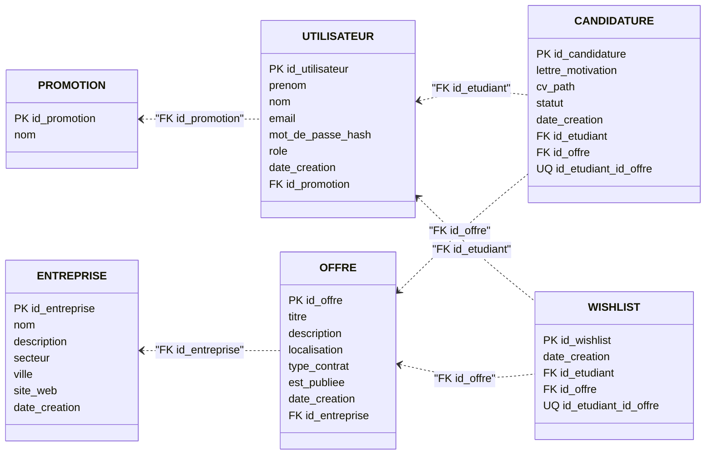

# Modele logique de donnees (MLD)

Ce document presente le `MLD` du projet `InternHub`.

Il correspond a la traduction relationnelle du `MCD` et prepare directement la mise en oeuvre dans un `SGBD SQL`.

Le `MLD` est formule ici de maniere independante du moteur exact (`SQLite`, `MySQL`, `PostgreSQL`, `MariaDB`, etc.), meme si le projet actuel dispose d'une implementation physique locale en `SQLite`.

## 1. Perimetre du MLD

Le modele logique couvre :

- les promotions,
- les utilisateurs,
- les entreprises,
- les offres,
- les candidatures,
- la wish-list.

Le cahier des charges mentionne egalement l'evaluation d'entreprise (`SFx5`).
Cette partie est ajoutee en fin de document comme extension logique, car elle figure dans le besoin metier mais n'est pas encore implantee dans le schema physique actuel.

## 2. Regles de passage du MCD au MLD

Les choix de transformation sont les suivants :

1. chaque entite devient une relation,
2. chaque identifiant devient une cle primaire,
3. les associations `1,N` sont traduites par une cle etrangere du cote `N`,
4. les associations `N,N` porteuses d'attributs sont traduites par une table d'association,
5. les contraintes metier d'unicite sont explicitees.

## 3. Schema relationnel principal

## PROMOTION

`PROMOTION`(
`id_promotion` PK,
`nom`
)

## UTILISATEUR

`UTILISATEUR`(
`id_utilisateur` PK,
`prenom`,
`nom`,
`email` UQ,
`mot_de_passe_hash`,
`role`,
`date_creation`,
`id_promotion` FK -> `PROMOTION.id_promotion` NULL
)

Remarques :

- `id_promotion` est nullable pour permettre un compte administrateur sans promotion.
- `role` porte la distinction `administrateur`, `pilote`, `etudiant`.

## ENTREPRISE

`ENTREPRISE`(
`id_entreprise` PK,
`nom`,
`description`,
`secteur`,
`ville`,
`site_web`,
`date_creation`
)

## OFFRE

`OFFRE`(
`id_offre` PK,
`titre`,
`description`,
`localisation`,
`type_contrat`,
`est_publiee`,
`date_creation`,
`id_entreprise` FK -> `ENTREPRISE.id_entreprise`
)

## CANDIDATURE

`CANDIDATURE`(
`id_candidature` PK,
`lettre_motivation`,
`cv_path`,
`statut`,
`date_creation`,
`id_etudiant` FK -> `UTILISATEUR.id_utilisateur`,
`id_offre` FK -> `OFFRE.id_offre`,
UQ(`id_etudiant`, `id_offre`)
)

Remarque :

- la contrainte d'unicite sur (`id_etudiant`, `id_offre`) traduit la regle :
  un etudiant ne peut candidater qu'une seule fois a une meme offre.

## WISHLIST

`WISHLIST`(
`id_wishlist` PK,
`date_creation`,
`id_etudiant` FK -> `UTILISATEUR.id_utilisateur`,
`id_offre` FK -> `OFFRE.id_offre`,
UQ(`id_etudiant`, `id_offre`)
)

Remarque :

- la contrainte d'unicite sur (`id_etudiant`, `id_offre`) evite les doublons dans la liste d'interets.

## 4. Lecture des dependances fonctionnelles

Le coeur logique du modele peut se lire ainsi :

- `id_promotion` -> `nom`
- `id_utilisateur` -> `prenom`, `nom`, `email`, `mot_de_passe_hash`, `role`, `date_creation`, `id_promotion`
- `id_entreprise` -> `nom`, `description`, `secteur`, `ville`, `site_web`, `date_creation`
- `id_offre` -> `titre`, `description`, `localisation`, `type_contrat`, `est_publiee`, `date_creation`, `id_entreprise`
- `id_candidature` -> `lettre_motivation`, `cv_path`, `statut`, `date_creation`, `id_etudiant`, `id_offre`
- `id_wishlist` -> `date_creation`, `id_etudiant`, `id_offre`

## 5. Representation synthetique du MLD

```text
PROMOTION(
  id_promotion PK,
  nom
)

UTILISATEUR(
  id_utilisateur PK,
  prenom,
  nom,
  email UQ,
  mot_de_passe_hash,
  role,
  date_creation,
  id_promotion FK -> PROMOTION.id_promotion NULL
)

ENTREPRISE(
  id_entreprise PK,
  nom,
  description,
  secteur,
  ville,
  site_web,
  date_creation
)

OFFRE(
  id_offre PK,
  titre,
  description,
  localisation,
  type_contrat,
  est_publiee,
  date_creation,
  id_entreprise FK -> ENTREPRISE.id_entreprise
)

CANDIDATURE(
  id_candidature PK,
  lettre_motivation,
  cv_path,
  statut,
  date_creation,
  id_etudiant FK -> UTILISATEUR.id_utilisateur,
  id_offre FK -> OFFRE.id_offre,
  UQ(id_etudiant, id_offre)
)

WISHLIST(
  id_wishlist PK,
  date_creation,
  id_etudiant FK -> UTILISATEUR.id_utilisateur,
  id_offre FK -> OFFRE.id_offre,
  UQ(id_etudiant, id_offre)
)
```

## 5bis. Schema visuel du MLD

La representation ci-dessous suit une logique plus proche d'un `MLD` classique :

- une table par relation,
- la `PK` est visible dans chaque table,
- les `FK` sont explicites,
- les tables d'association apparaissent comme de vraies relations du modele.



## 5ter. Lecture courte du schema visuel

Le schema relationnel se lit ainsi :

- `UTILISATEUR.id_promotion` reference `PROMOTION.id_promotion`
- `OFFRE.id_entreprise` reference `ENTREPRISE.id_entreprise`
- `CANDIDATURE.id_etudiant` reference `UTILISATEUR.id_utilisateur`
- `CANDIDATURE.id_offre` reference `OFFRE.id_offre`
- `WISHLIST.id_etudiant` reference `UTILISATEUR.id_utilisateur`
- `WISHLIST.id_offre` reference `OFFRE.id_offre`

Les contraintes d'unicite importantes sont :

- `UTILISATEUR.email`
- `CANDIDATURE(id_etudiant, id_offre)`
- `WISHLIST(id_etudiant, id_offre)`

## 6. Contraintes logiques importantes

Les contraintes suivantes doivent etre conservees dans le modele relationnel :

1. `email` doit etre unique pour chaque utilisateur.
2. une offre doit toujours etre rattachee a une entreprise.
3. une candidature doit toujours etre rattachee a un etudiant et a une offre.
4. une entree de wish-list doit toujours etre rattachee a un etudiant et a une offre.
5. une meme candidature ne doit pas exister deux fois pour le meme couple (`etudiant`, `offre`).
6. une meme entree de wish-list ne doit pas exister deux fois pour le meme couple (`etudiant`, `offre`).
7. un utilisateur peut exister sans promotion uniquement si son role le permet dans le cadre des regles metier.

## 7. Extension logique pour SFx5 : evaluation d'entreprise

Si la fonctionnalite `SFx5 - Evaluer une entreprise` est ajoutee au schema physique, le `MLD` peut etre complete ainsi :

`EVALUATION_ENTREPRISE`(
`id_evaluation` PK,
`note`,
`commentaire`,
`date_creation`,
`id_utilisateur` FK -> `UTILISATEUR.id_utilisateur`,
`id_entreprise` FK -> `ENTREPRISE.id_entreprise`
)

Selon la regle choisie, on peut ajouter :

- soit aucune contrainte d'unicite,
- soit `UQ(id_utilisateur, id_entreprise)` si l'on souhaite limiter une evaluation par utilisateur et par entreprise.

## 8. Ecart entre le MLD cible et l'implementation actuelle

Le schema physique actuel couvre deja les relations suivantes :

- `PROMOTION`
- `UTILISATEUR`
- `ENTREPRISE`
- `OFFRE`
- `CANDIDATURE`
- `WISHLIST`

Le schema physique actuel n'integre pas encore :

- `EVALUATION_ENTREPRISE`

De plus :

- le projet actuel comporte deja une contrainte d'unicite sur `WISHLIST(id_etudiant, id_offre)`,
- mais l'unicite logique sur `CANDIDATURE(id_etudiant, id_offre)` doit etre retenue comme regle de reference, meme si elle n'est pas encore materialisee par une contrainte explicite dans le bootstrap local.

## 9. Version courte a integrer dans un dossier

Si une version plus concise est necessaire, le `MLD` peut etre resume ainsi :

`PROMOTION(id_promotion, nom)`

`UTILISATEUR(id_utilisateur, prenom, nom, email, mot_de_passe_hash, role, date_creation, id_promotion#)`

`ENTREPRISE(id_entreprise, nom, description, secteur, ville, site_web, date_creation)`

`OFFRE(id_offre, titre, description, localisation, type_contrat, est_publiee, date_creation, id_entreprise#)`

`CANDIDATURE(id_candidature, lettre_motivation, cv_path, statut, date_creation, id_etudiant#, id_offre#)`

`WISHLIST(id_wishlist, date_creation, id_etudiant#, id_offre#)`

Avec :

- `#` = cle etrangere,
- `email` unique,
- (`id_etudiant`, `id_offre`) unique dans `CANDIDATURE`,
- (`id_etudiant`, `id_offre`) unique dans `WISHLIST`.
