# Site map de l'application

Ce document presente le `site map` fonctionnel de `InternHub`.

Il synthétise :

- les pages publiques,
- les espaces par role,
- les ecrans de gestion,
- les pages systeme,
- et les liens structurants entre ces ensembles.

L'objectif est de disposer d'une vue d'ensemble de l'application, complementaire aux documents de navigation, d'inventaire des vues et de handoff UX.

## 1. Principes de lecture

Le site map est organise par grands ensembles :

1. `Public`
2. `Authentification`
3. `Etudiant`
4. `Pilote`
5. `Administrateur`
6. `Pages systeme et support`

Important :

- les routes `POST` d'action ne sont pas toutes detaillees ici, car le site map decrit avant tout les vues et les parcours de navigation,
- certaines actions existent sans page dediee visible dans le menu, par exemple `logout`, ajout ou suppression en wish-list, suppression CRUD,
- les acces restent soumis a la matrice de permissions.

## 2. Site map global

```mermaid
flowchart TD
    HOME["/ Accueil"]
    LOGIN["/login Connexion"]

    OFFERS["/offres Liste offres"]
    OFFER_DETAIL["/offres/{id} Detail offre"]
    APPLY["/offres/{id}/postuler Postuler"]

    COMPANIES["/entreprises Liste entreprises"]
    COMPANY_DETAIL["/entreprises/{id} Detail entreprise"]
    STATS["/statistiques Statistiques"]
    LEGAL["/mentions-legales Mentions legales"]

    STUDENT_DASH["/dashboard/etudiant"]
    STUDENT_APPS["/dashboard/etudiant/candidatures"]
    STUDENT_APP_DETAIL["/dashboard/etudiant/candidatures/{id}"]
    STUDENT_PROFILE["/dashboard/etudiant/profil"]
    STUDENT_WISHLIST["/dashboard/etudiant/wishlist"]

    PILOT_DASH["/dashboard/pilote"]
    PILOT_STUDENTS["/dashboard/pilote/etudiants"]
    PILOT_STUDENT_CREATE["/dashboard/pilote/etudiants/create"]
    PILOT_STUDENT_DETAIL["/dashboard/pilote/etudiants/{id}"]
    PILOT_STUDENT_APPS["/dashboard/pilote/etudiants/{id}/candidatures"]
    PILOT_APP_DETAIL["/dashboard/pilote/candidatures/{id}"]
    PILOT_COMPANIES["/dashboard/pilote/entreprises"]
    PILOT_COMPANY_FORM["/dashboard/pilote/entreprises/create et edit"]
    PILOT_OFFERS["/dashboard/pilote/offres"]
    PILOT_OFFER_FORM["/dashboard/pilote/offres/create et edit"]

    ADMIN_DASH["/dashboard/admin"]
    ADMIN_ACCOUNTS["/admin/comptes"]
    ADMIN_ACCOUNT_FORM["/admin/comptes/create et edit"]
    ADMIN_COMPANIES["/admin/entreprises"]
    ADMIN_COMPANY_FORM["/admin/entreprises/create et edit"]
    ADMIN_OFFERS["/admin/offres"]
    ADMIN_OFFER_FORM["/admin/offres/create et edit"]

    ERR403["403"]
    ERR404["404"]
    ERR500["500"]

    HOME --> OFFERS
    HOME --> COMPANIES
    HOME --> STATS
    HOME --> LOGIN
    HOME --> LEGAL

    OFFERS --> OFFER_DETAIL
    OFFER_DETAIL --> APPLY
    COMPANIES --> COMPANY_DETAIL
    COMPANY_DETAIL --> OFFER_DETAIL

    LOGIN --> STUDENT_DASH
    LOGIN --> PILOT_DASH
    LOGIN --> ADMIN_DASH

    STUDENT_DASH --> STUDENT_APPS
    STUDENT_DASH --> STUDENT_PROFILE
    STUDENT_DASH --> STUDENT_WISHLIST
    STUDENT_APPS --> STUDENT_APP_DETAIL
    OFFER_DETAIL --> STUDENT_WISHLIST

    PILOT_DASH --> PILOT_STUDENTS
    PILOT_DASH --> PILOT_COMPANIES
    PILOT_DASH --> PILOT_OFFERS
    PILOT_STUDENTS --> PILOT_STUDENT_CREATE
    PILOT_STUDENTS --> PILOT_STUDENT_DETAIL
    PILOT_STUDENT_DETAIL --> PILOT_STUDENT_APPS
    PILOT_STUDENT_APPS --> PILOT_APP_DETAIL
    PILOT_COMPANIES --> PILOT_COMPANY_FORM
    PILOT_OFFERS --> PILOT_OFFER_FORM

    ADMIN_DASH --> ADMIN_ACCOUNTS
    ADMIN_DASH --> ADMIN_COMPANIES
    ADMIN_DASH --> ADMIN_OFFERS
    ADMIN_DASH --> STATS
    ADMIN_ACCOUNTS --> ADMIN_ACCOUNT_FORM
    ADMIN_COMPANIES --> ADMIN_COMPANY_FORM
    ADMIN_OFFERS --> ADMIN_OFFER_FORM
```



## 3. Arborescence par zones

## 3.1 Zone publique

```text
/
├── /offres
│   └── /offres/{id}
│       └── /offres/{id}/postuler
├── /entreprises
│   └── /entreprises/{id}
├── /statistiques
├── /mentions-legales
└── /login
```

Remarques :

- `/offres/{id}/postuler` n'est accessible qu'aux etudiants authentifies,
- depuis une fiche entreprise, l'utilisateur peut basculer vers les offres associees,
- la zone publique constitue le point d'entree principal pour la demo produit.

## 3.2 Zone etudiant

```text
/dashboard/etudiant
├── /dashboard/etudiant/candidatures
│   └── /dashboard/etudiant/candidatures/{id}
│       └── /dashboard/etudiant/candidatures/{id}/cv
├── /dashboard/etudiant/profil
└── /dashboard/etudiant/wishlist
```

Remarques :

- l'etudiant consulte, suit, telecharge son CV et gere sa wish-list,
- l'action de candidature se fait depuis le detail d'offre public,
- le dashboard etudiant agit comme hub personnel.

## 3.3 Zone pilote

```text
/dashboard/pilote
├── /dashboard/pilote/etudiants
│   ├── /dashboard/pilote/etudiants/create
│   ├── /dashboard/pilote/etudiants/{id}
│   │   ├── /dashboard/pilote/etudiants/{id}/candidatures
│   │   └── /dashboard/pilote/etudiants/{id}/edit
├── /dashboard/pilote/candidatures/{id}
│   └── /dashboard/pilote/candidatures/{id}/cv
├── /dashboard/pilote/entreprises
│   ├── /dashboard/pilote/entreprises/create
│   └── /dashboard/pilote/entreprises/{id}/edit
└── /dashboard/pilote/offres
    ├── /dashboard/pilote/offres/create
    └── /dashboard/pilote/offres/{id}/edit
```

Remarques :

- le pilote a un double role : supervision pedagogique et gestion metier locale,
- il gere les comptes etudiants de sa promotion,
- il suit les candidatures de ses etudiants,
- il peut egalement gerer entreprises et offres.

## 3.4 Zone administrateur

```text
/dashboard/admin
├── /admin/comptes
│   ├── /admin/comptes/create
│   └── /admin/comptes/{id}/edit
├── /admin/entreprises
│   ├── /admin/entreprises/create
│   └── /admin/entreprises/{id}/edit
└── /admin/offres
    ├── /admin/offres/create
    └── /admin/offres/{id}/edit
```

Remarques :

- l'administrateur supervise la structure globale,
- il gere les comptes,
- il dispose egalement des ecrans CRUD sur entreprises et offres,
- il accede aussi aux pages publiques et aux statistiques.

## 3.5 Pages systeme et support

```text
/statistiques
/mentions-legales
403
404
500
```

Remarques :

- ces pages ne relèvent pas toutes d'un role unique,
- elles participent a la completude du produit et a sa stabilisation.

## 4. Tableau de lecture rapide par role

| Zone / page | Anonyme | Etudiant | Pilote | Administrateur |
| --- | --- | --- | --- | --- |
| `/` | Oui | Oui | Oui | Oui |
| `/login` | Oui | Oui | Oui | Oui |
| `/offres` et `/offres/{id}` | Oui | Oui | Oui | Oui |
| `/entreprises` et `/entreprises/{id}` | Oui | Oui | Oui | Oui |
| `/statistiques` | Oui | Oui | Oui | Oui |
| `/offres/{id}/postuler` | Non | Oui | Non | Non |
| `/dashboard/etudiant/*` | Non | Oui | Non | Non |
| `/dashboard/pilote/*` | Non | Non | Oui | Non |
| `/dashboard/admin` | Non | Non | Non | Oui |
| `/admin/*` | Non | Non | Non | Oui |

## 5. Pages coeur a retenir

Si une version plus courte du site map est necessaire, les pages coeur du projet sont :

- `/`
- `/login`
- `/offres`
- `/offres/{id}`
- `/offres/{id}/postuler`
- `/entreprises`
- `/entreprises/{id}`
- `/dashboard/etudiant`
- `/dashboard/etudiant/candidatures`
- `/dashboard/pilote`
- `/dashboard/pilote/etudiants`
- `/admin/comptes`
- `/statistiques`
- `/mentions-legales`

## 6. Positionnement du document

Ce site map est complementaire de :

- [15-inventaire-vues.md](/Users/abdoufrigaa/Projects/internhub/docs/04-ux/15-inventaire-vues.md)
- [16-navigation-et-parcours.md](/Users/abdoufrigaa/Projects/internhub/docs/04-ux/16-navigation-et-parcours.md)
- [25-spec-pages-publiques-listing-detail.md](/Users/abdoufrigaa/Projects/internhub/docs/04-ux/25-spec-pages-publiques-listing-detail.md)
- [26-spec-pages-etudiant.md](/Users/abdoufrigaa/Projects/internhub/docs/04-ux/26-spec-pages-etudiant.md)
- [27-spec-pages-pilote.md](/Users/abdoufrigaa/Projects/internhub/docs/04-ux/27-spec-pages-pilote.md)
- [28-spec-pages-admin.md](/Users/abdoufrigaa/Projects/internhub/docs/04-ux/28-spec-pages-admin.md)
- [29-spec-pages-management-crud.md](/Users/abdoufrigaa/Projects/internhub/docs/04-ux/29-spec-pages-management-crud.md)
- [30-spec-pages-systeme-support.md](/Users/abdoufrigaa/Projects/internhub/docs/04-ux/30-spec-pages-systeme-support.md)
